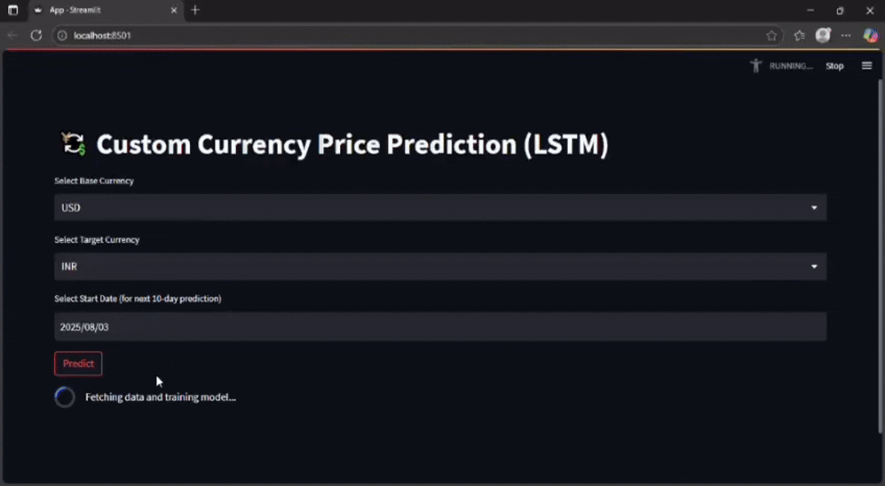

# 💱 Currency Price Prediction (LSTM + Streamlit)

This project is a **Currency Price Prediction** that uses **LSTM (Long Short-Term Memory)** neural networks to forecast the **next 10 days of exchange rates** between selected base and target currencies. Built with **Streamlit**, it fetches live currency data and displays interactive predictions with graphs and insights.

---

### 📽️ Demo of the Project



---

### Features

- Predicts **next 10 days** of currency exchange rates
- Supports major currencies: **USD, INR, EUR, GBP, JPY**
- Displays **next-day prediction** with highlighted value
- Interactive graph using **Plotly**
- Shows **current exchange rate** from real-time data
- Uses **Alpha Vantage API** to fetch currency history
- Built using **Streamlit** for a simple and clean UI

---

### Tech Stack

- Python  
- Streamlit  
- TensorFlow / Keras  
- Pandas & NumPy  
- Plotly  
- scikit-learn  
- Alpha Vantage API

---

### How It Works

1. User selects the **base and target currency**
2. App fetches **last 60 days** of data before the selected date
3. Data is normalized and prepared for LSTM input
4. A fresh **LSTM model** is trained on this data
5. Model predicts the next **10-day price forecast**
6. Results are displayed with styled highlights and an interactive graph

---

### Requirements

**Python version:**  
Python 3.7.6

**Install dependencies using pip:**

```bash
pip install streamlit pandas numpy plotly tensorflow scikit-learn requests
```

---

### Set up API Key
Create a file at: .streamlit/secrets.toml

Add the following content:

```toml
[ALPHAVANTAGE_API_KEY]
ALPHAVANTAGE_API_KEY = "your_api_key_here"
```

You can create  your own free API key from:
 https://www.alphavantage.co/support/#api-key

---
### To Run This Project

```python
streamlit run app.py
```

---
###  Future Improvements

- Add more currency options
- Add model options (e.g., ARIMA, Prophet)
- Deploy to Streamlit Cloud
- Export forecast as downloadable CSV

